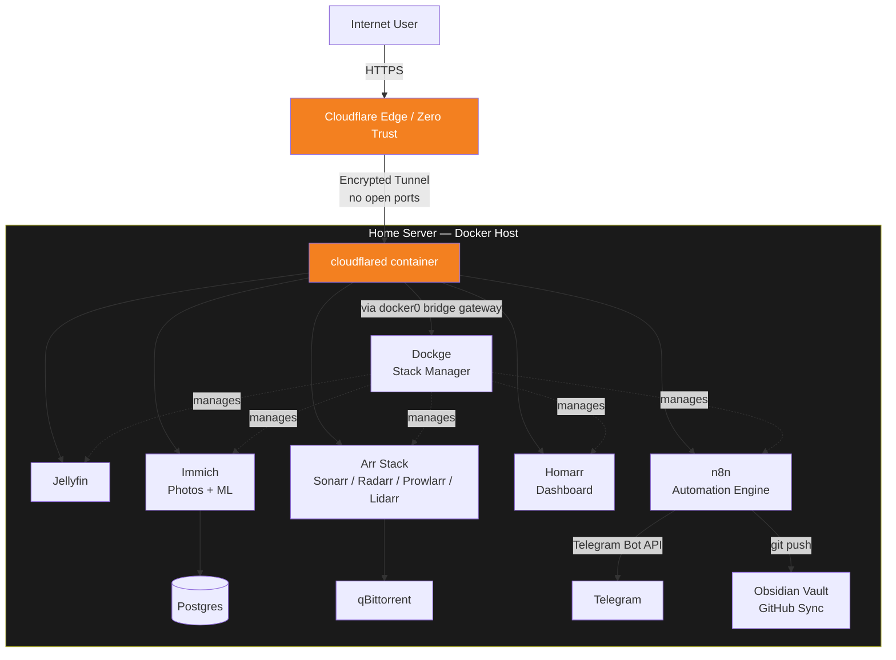

# 🏠 Self-Hosted Home Server & Automation Platform

A production-style home server running **20+ containerized services** on consumer hardware, built and hardened through hands-on debugging of real networking, permissions, and reliability issues — not a copy-pasted tutorial stack.

Built and operated with production-style practices — automated health monitoring, least-privilege access control, and documented incident response — on consumer hardware.

---

## 📡 Architecture Overview

All external access is routed through a **Cloudflare Zero Trust Tunnel** — no ports are ever opened on the router's WAN side. Internally, `cloudflared` reaches every service via the Docker host bridge gateway rather than requiring containers to share a network, which keeps each stack's networking independent and easy to reason about.

---

## 🏆 Key Achievements

- **Zero exposed ports** — full remote access to 15+ subdomains via Cloudflare Tunnel, with no router-level port forwarding at any point.
- **Diagnosed a non-obvious container networking model**: discovered and documented that `cloudflared` reaches services through the Docker bridge gateway IP rather than shared custom networks — then used that insight to fix a broken dashboard integration that custom per-stack networks had accidentally isolated.
- **Resolved a multi-layered permission failure** across three unrelated symptoms (broken automation engine, broken audio passthrough, broken user-space audio daemon) that all traced back to a single missing Linux group membership — rather than patching each symptom separately.
- **Built a self-healing dual-interface network failover** (Ethernet ⇄ WiFi) using a NetworkManager dispatcher script, after root-causing an mDNS discovery failure to two active interfaces sharing one subnet.
- **Designed and deployed automation pipelines** (n8n) for infrastructure self-monitoring (SMART disk health → Telegram alerts) and an AI-powered note-capture pipeline (voice/text → Gemini transcription & translation → Git-synced Markdown vault).
- **Practiced least-privilege access control**: scoped a sudoers entry to a single binary rather than granting broad sudo, and scoped API keys/permissions to only what each integration actually required.
- **Managed a 20+ service container fleet** via Dockge with automated image updates (Watchtower), explicitly excluding stateful database containers from auto-update to protect data integrity.

---

## 🧱 Tech Stack

| Layer | Tools |
|---|---|
| Host OS | Linux Mint (Cinnamon) |
| Container Orchestration | Docker Compose, managed via Dockge |
| Remote Access | Cloudflare Zero Trust Tunnel |
| Media | Jellyfin, Immich, Sonarr, Radarr, Prowlarr, Lidarr, qBittorrent |
| Automation | n8n (self-hosted), Google Gemini API |
| Monitoring | Beszel, custom SMART-health cron pipeline |
| Dashboard | Homarr |
| Federation | Akkoma (self-hosted Fediverse instance) |

---

## 📚 Documentation

- [`docs/architecture.md`](docs/architecture.md) — deep technical breakdown of the network and stack design
- [`docs/troubleshooting.md`](docs/troubleshooting.md) — real bugs encountered and how they were root-caused and fixed

---

## ⚠️ A note on this repo

This repository documents **configuration patterns and architecture**, not a copy-pasteable deployment. All compose files here use placeholder domains, IPs, and secrets — you'll need to substitute your own values and are expected to understand each service before running it in production.
